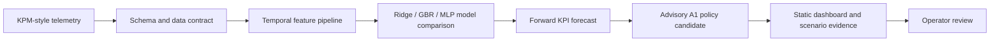

# AI-RAN KPI Forecasting - Non-RT RIC rApp Pattern

## One-line summary

A reproducible Non-RT RIC rApp pattern for AI-for-RAN KPI forecasting: KPM-style telemetry in, forward-looking KPI forecasts out, advisory A1 policy candidates generated, and static evidence dashboards published for review.

This is not a claim of a deployed RIC application. It is a reproducible engineering pattern with typed contracts, no-leakage forecasting, scenario evidence, and explicit deployment boundaries.

> **▶ [Open the live evidence portal](https://obiedeh.github.io/ai-ran-kpi-forecasting/reports/index.html)** · [Dashboard](https://obiedeh.github.io/ai-ran-kpi-forecasting/reports/dashboard.html) · [Tech brief](TECH_BRIEF.md) · [Data contract](DATA_CONTRACT.md) · [Project status](PROJECT_STATUS.md)

## Why this exists

RAN operations cannot rely only on after-the-fact dashboards. The practical question is whether a non-real-time intelligence layer can see KPI degradation early enough to recommend a policy review before the cell is already in trouble.

From an engineering standpoint, I built this as a bridge between telecom KPI analytics and the way AI-for-RAN work is expected to be packaged: contracts, evidence, policy boundaries, and reproducible artifacts. A forecasting model alone is not enough signal.

The Non-RT RIC / rApp model is the relevant O-RAN architectural pattern for this class of non-real-time RAN intelligence: telemetry-driven analytics, forecasting, policy recommendation, and model lifecycle support. This repo implements that pattern on synthetic/sample telemetry; integration with FlexRIC, OSC RIC, or a vendor RIC is documented but not exercised.

## What problem it solves

This project asks a more operational question than “can a model forecast a KPI?” It asks whether a Non-RT intelligence layer can package forecast evidence, scenario impact, and an advisory A1 policy candidate in a way an engineer could inspect before taking action.

## The engineering pattern



## Live evidence portal

- [Live evidence portal](https://obiedeh.github.io/ai-ran-kpi-forecasting/reports/index.html)
- [Live dashboard](https://obiedeh.github.io/ai-ran-kpi-forecasting/reports/dashboard.html)
- [Published local portal](reports/publish/latest/index.html)
- [Scenario dashboards](reports/scenarios/latest/)

GitHub shows committed HTML files as source code. Use the GitHub Pages links above to open the rendered pages.

## Headline evidence

| Signal | Value | Source |
|---|---|---|
| KPM-style input contract | shipped | `schemas/kpm_input_v1.json` |
| Advisory A1 output contract | shipped | `schemas/a1_policy_v1.json` |
| rApp packaging signal | shipped | `rapp_manifest.yaml` |
| Three-model comparison | Ridge 0.8368 RMSE, GBR 2.8755 RMSE, MLP 22.5926 RMSE | `reports/model_comparison/comparison_metrics.md` |
| Sample forecast metrics | RMSE 0.8368, MAE 0.6954, MAPE 0.8204% | `reports/forecast_examples/latest/metrics.json` |
| R1-style dataflow demo | KPM-style input to forecast to A1 candidate | `reports/r1_dataflow_demo/` |
| Scenario evidence | congestion, backhaul saturation, cell outage | `reports/scenarios/latest/` |
| Telecom Italia MI benchmark | Benchmark-ready: pending local public dataset files. No benchmark metric claimed yet. | `reports/forecast_examples/telecom_italia_mi/` |
| Reproducibility | `make verify` regenerates committed evidence artifacts | `Makefile` |

## What makes this more than a forecasting notebook

- Temporal evaluation: train/test splits preserve time order; no shuffled leakage.
- Operational feature design: lag features use only past KPI values available at inference time.
- Typed RAN telemetry contract: `schemas/kpm_input_v1.json` defines the KPM-style input boundary.
- Typed policy output contract: `schemas/a1_policy_v1.json` defines the advisory A1 candidate boundary.
- rApp packaging signal: `rapp_manifest.yaml` documents identity, inputs, outputs, and integration expectations.
- Scenario evidence: congestion, backhaul saturation, and cell outage reports connect forecasts to operator action.
- Reproducibility: `make verify` regenerates committed evidence artifacts.
- Honest boundary: no live RIC deployment, no autonomous control, no production policy enforcement.

## Architecture

The architecture is documented in [docs/architecture.md](docs/architecture.md), with Mermaid diagrams under [docs/diagrams/](docs/diagrams/).

The core runtime path is:

```text
KPM-style telemetry -> validation and feature generation -> temporal forecasting
-> advisory A1 policy candidate -> report artifacts -> operator review
```

## Dashboard and report artifacts

| Artifact | Purpose |
|---|---|
| `reports/index.html` | GitHub Pages evidence portal |
| `reports/dashboard.html` | top-level operational dashboard generated with the portal |
| `reports/forecast_examples/latest/metrics.json` | sample forecast metrics |
| `reports/model_comparison/comparison_metrics.md` | Ridge / GBR / MLP comparison |
| `reports/r1_dataflow_demo/a1_policy_candidate.json` | advisory A1 policy candidate |
| `reports/scenarios/latest/` | congestion, backhaul, and outage evidence packs |
| `reports/publish/latest/index.html` | release-friendly landing page |

## Measured results

The committed measured results use deterministic sample telemetry, not live operator data.

| Measurement | Result | Boundary |
|---|---:|---|
| Sample PRB forecast RMSE | 0.8368 | ridge baseline on `data/ran_kpi_sample.csv` |
| Sample PRB forecast MAE | 0.6954 | same sample, same temporal split |
| Sample PRB forecast MAPE | 0.8204% | small sample metric only |
| Gradient boosting RMSE | 2.8755 | weaker on current sample |
| MLP RMSE | 22.5926 | underfits current sample |

The small-data result is intentionally visible: Ridge wins here. The model is the least interesting part of the repo; the useful part is the engineering boundary around the model. The public Telecom Italia MI path exists to test whether model ranking changes on a larger dataset.

## Benchmark readiness: Telecom Italia MI

The repo includes a public benchmark path for the Telecom Italia Milan dataset, but the dataset is not committed because of size and licensing/distribution constraints.

Current status:

- Loader path: `ai_ran_kpi_forecasting.data.load_telecom_italia_mi`
- Make target: `make run-telecom`
- Output target: `reports/forecast_examples/telecom_italia_mi/`
- Published result: Benchmark-ready: pending local public dataset files. No benchmark metric claimed yet.

To run when data is available:

```bash
make run-telecom REPORT_DIR=reports/forecast_examples/telecom_italia_mi
cat reports/forecast_examples/telecom_italia_mi/metrics.json
```

Until that artifact exists, this repo does not claim Telecom Italia MI benchmark accuracy.

## GitHub repo description

Recommended description:

> Non-RT RIC rApp pattern for AI-RAN KPI forecasting, scenario evidence, and advisory A1 policy generation.

## Credibility boundary

This repo demonstrates a Non-RT RIC rApp pattern for AI-for-RAN KPI forecasting on synthetic and small sample telemetry. The boundary is not a weakness; it is what keeps the evidence useful. It does not claim:

- live RAN integration
- live Non-RT RIC deployment
- operator validation
- E2, A1, O1, or R1 wire-protocol implementation
- autonomous network control
- closed-loop policy enforcement
- production rApp lifecycle or service registration

The deliverable is the pattern, contracts, model comparison, and evidence pack.

## Quickstart

```bash
git clone https://github.com/obiedeh/ai-ran-kpi-forecasting.git
cd ai-ran-kpi-forecasting
python -m venv .venv
source .venv/bin/activate
make install-dev
make run-sample
cat reports/forecast_examples/latest/metrics.json
```

Windows / direct Python:

```powershell
python -m venv .venv
.\.venv\Scripts\activate
pip install -r requirements.txt -r requirements-dev.txt
python ai-ran-kpi-forecasting.py run-sample --output-dir reports/forecast_examples/latest
python ai-ran-kpi-forecasting.py portal --output reports/index.html
```

## Reproduce all artifacts

```bash
make verify
```

`make verify` runs lint, tests, sample forecast, model comparison, R1 dataflow demo, scenario dashboards, portal generation, and publish-page generation.

## Repository map

```text
configs/                         sample run configuration
data/                            committed sample telemetry
docs/                            architecture and AI-RAN integration notes
reports/                         committed evidence artifacts and HTML pages
schemas/                         KPM input and advisory A1 policy contracts
scripts/                         model comparison and R1 dataflow demo scripts
src/ai_ran_kpi_forecasting/       package source
tests/                           unit and pipeline tests
rapp_manifest.yaml               rApp identity, inputs, outputs, and boundary
```

## Engineering signal

This project is designed around the operational shape of an AI-for-RAN workflow, not just model accuracy. The core signal is the boundary discipline around the model: typed telemetry input, time-ordered evaluation, scenario evidence, advisory policy output, and explicit limits around deployment.

- Temporal evaluation is used instead of shuffled train/test splits, so the forecast is tested closer to how it would behave in operation.
- KPM-style input and A1 advisory output are defined as typed contracts, making the system boundaries inspectable.
- Forecast outputs are connected to advisory policy candidates instead of being left as standalone charts.
- Weak model results remain visible in the evidence pack, because hiding them would make the evaluation less credible.
- The Telecom Italia MI benchmark path is prepared, but no benchmark result is claimed until the dataset is run locally.
- The HTML evidence pack is generated and GitHub Pages compatible, so results can be reviewed without cloning the repo.

## Next engineering steps

The next steps are intentionally narrow: improve evidence quality before adding integration complexity.

1. Run the Telecom Italia MI benchmark locally and publish the measured metrics.
2. Extend the workflow to multi-cell batch forecasting while preserving temporal evaluation and no-leakage feature rules.
3. Add drift and retraining-readiness reports so the project reflects an operational AI lifecycle.
4. Add a real Non-RT RIC adapter only when there is a target OSC RIC, FlexRIC, or vendor RIC environment to test against.

## License

MIT.
