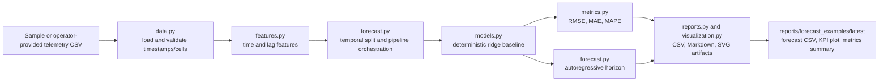

# Architecture

This project is a compact forecasting engineering workflow for AI-RAN and edge infrastructure telemetry. It keeps the scope practical: CSV telemetry in, deterministic baseline forecasting, report artifacts out.

## Module Responsibilities

- `data.py`: load generic RAN KPI CSV files, normalize Telecom Italia MI samples, and generate bounded synthetic telemetry for demos and tests.
- `features.py`: select KPI columns, add cyclical time features, add lag features, and build numeric model matrices.
- `models.py`: train and evaluate the deterministic ridge regression baseline.
- `forecast.py`: run the end-to-end workflow, perform temporal train/test splitting, and generate forward forecasts.
- `metrics.py`: calculate regression metrics for hold-out evaluation.
- `visualization.py`: write dependency-light SVG plots for KPI forecasts, feature importance, and impact summaries.
- `cli.py`: expose reproducible command-line workflows while keeping the top-level script as a thin compatibility wrapper.

## Operational Boundaries

The repository does not claim live RAN control, autonomous optimization, or direct network integration. It is an evidence-oriented forecasting project for offline telemetry analysis, reproducible benchmarks, and operational reporting.
